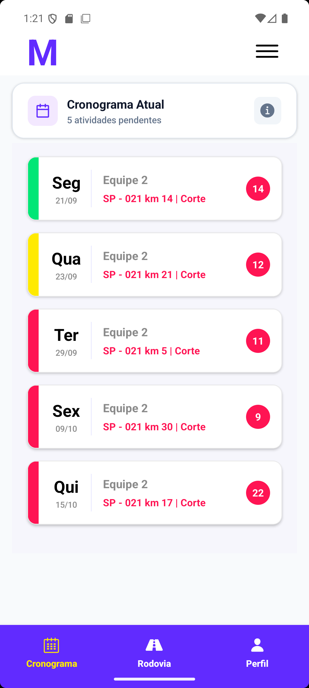
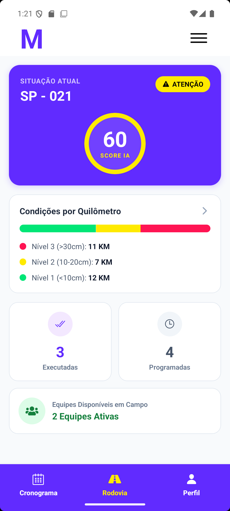
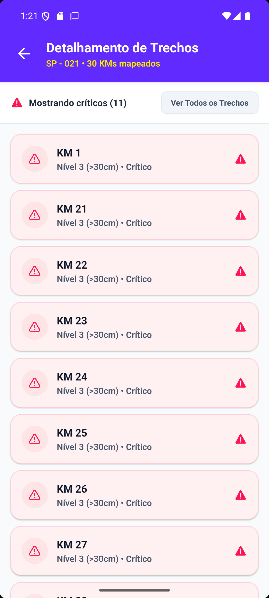

# VegiaMonitor
---

## 👥 Integrantes
* Eduardo Abreu
* Gabriel De Biasi Couto
* Gabriel dos Anjos
* João Pedro da Silva Costa
* João Pedro de Souza Ferreira
* Rodrigo Campos Cordeiro

---
## 🚦 Status das Funcionalidades (Sprint 3 — Protótipo Funcional Completo)

| Funcionalidade | Descrição | Status Atual |
| :--- | :--- | :---: |
| **Autenticação por CPF e Senha** | Validação de credenciais de operador/equipe através de contexto global (`AuthContext`) consumindo dados do `usuarios.json`. | 🟢 **Concluído** |
| **Dashboard de Condições da Rodovia** | Exibição do Score Geral de Conservação (gerado por IA) e segmentação dos trechos por nível de vegetação. | 🟢 **Concluído** |
| **Cronograma Operacional** | Lista de atividades de corte/roçada pendentes, filtradas dinamicamente de acordo com a equipe do colaborador logado. | 🟢 **Concluído** |
| **Indicadores Visuais de Prazo** | Código de cores dinâmico no cronograma (Verde: Hoje, Amarelo: Esta Semana, Vermelho: Próxima Semana) e modal informativo de legenda. | 🟢 **Concluído** |
| **Central de Notificações** | Exibição de alertas urgentes e informativos de segurança e alterações de rota. | 🟢 **Concluído** |
| **Perfil e Integração WhatsApp** | Exibição de dados do colaborador logado e redirecionamento direto via Deep Linking para o WhatsApp do supervisor. | 🟢 **Concluído** |
| **Documento de Testes Manuais** | Tabela contendo os 5+ fluxos principais testados, resultados esperados vs. obtidos e status de execução (`TESTES.md`). | 🟢 **Concluído** |

---

## ☀️ Design e Acessibilidade em Campo (Visibilidade sob Luz Solar)

Como a aplicação é voltada para operadores que atuam diretamente em trechos abertos de rodovias, **a interface visual foi especialmente projetada para garantir máxima legibilidade em ambientes sob forte incidência de luz solar e reflexos na tela**:

* **Alto Contraste Visual:** Utilização de fundos claros (`#F8FAFC` e `#FFFFFF`) combinados com tipografia pesada (`fontWeight: 'bold'`) em tons escuros (`#0F172A` e `#000000`), evitando cores pasteis ou neutras que somem sob a iluminação solar direta.
* **Sinalização Visual de Alto Impacto:** Elementos de status e urgência utilizam blocos de cores saturadas e barras laterais calibradas (Verde Vivo `#00E676`, Amarelo `#FFEA00` e Rosa/Vermelho Neon `#FF1453`), permitindo identificação imediata da prioridade sem necessidade de esforço visual ou leitura atenta de pequenos textos.
* **Hierarquia Tipográfica Expandida:** Títulos e indicadores principais possuem tamanhos de fonte ampliados (22px/18px com negrito) para garantir leitura rápida mesmo em movimento ou em smartphones com película protetora acentuada por poeira e reflexos.
* **Áreas de Toque Ampliadas (Touch Targets):** Botões e seletores possuem preenchimento extra (*paddings* de 12px a 16px) e bordas bem definidas, facilitando o manuseio rápido por operadores no campo.

---

## ⚠️ Pendências Identificadas & Plano de Ajustes (Sprint 4)

### Pendências Identificadas
1. **Consumo de Dados:** Dependência exclusiva de Mocks JSON locais (`usuarios.json`, `rocadas.json`, `rodovias.json`).
2. **Persistência de Dados Offline:** Necessidade de aprimorar a sincronização e cache de alterações locais via `AsyncStorage` quando houver perda de conexão na estrada.
3. **Feedback de Ações:** Adicionar feedbacks visuais (loaders e componentes Toast/Alerts customizados) ao realizar a troca de dados ou tentar login sem conexão.

### Plano de Ajustes para a Sprint 4
* **Integração com Backend API:** Substituir a camada de mocks por chamadas HTTP RESTful para consumo de dados em tempo real.
* **Estratégia Offline-First:** Implementar fila de sincronização (Sync Queue) com `AsyncStorage` para armazenar status das roçadas quando offline e disparar para a API assim que a conexão for reestabelecida.
* **Refinamento de UI/UX:** Adicionar telas de *Skeleton Loading* nas listas e tratamento de estados vazios (*empty states*).

## ⚠️ O Problema Escolhido
A falta de comunicação em tempo real e a ausência de rastreabilidade entre os gestores de monitoramento e as frentes de conservação rodoviária (como as equipes de corte). 

Isso gera atrasos no cronograma, dificuldade em reportar imprevistos na via e risco de não conformidade com as exigências regulatórias da ARTESP e ANTT.

---

## 👤 A Persona Principal
* **Perfil:** Supervisor da Frente de Conservação (Equipe de Corte), 42 anos.
* **Rotina:** Ele está diariamente na rodovia coordenando os operadores. Precisa garantir que a equipe cumpra a meta do dia com segurança.
* **Habilidades Tecnológicas:** Tem familiaridade básica com smartphones, mas pouca paciência para sistemas complexos ou que necessitam 100% de estar conectado à internet.

---

## 💡 Proposta de Solução
O **VegiaMonitor** é um aplicativo mobile focado em criar uma ponte digital entre o campo e a gestão da Motiva. Ele centraliza a rotina do operador de campo, permitindo visualizar cronogramas de trabalho com indicadores visuais de prazo, acompanhar o score e a condição exata da rodovia (nível da grama), receber alertas da gestão em tempo real e facilitar o contato rápido com os supervisores.

---

## 🛠️ Stack Tecnológica e Justificativa

* **Frontend Mobile:** React Native com Expo.
  * *Justificativa:* Permite o desenvolvimento ágil e multiplataforma com uma única base de código em JavaScript/TypeScript. O ecossistema do Expo agiliza o setup do projeto e o teste em dispositivos físicos.
* **Navegação:** React Navigation (Bottom Tabs e Stack).
  * *Justificativa:* Garante uma navegação fluida entre as telas principais (Cronograma, Rodovia, Perfil) e fluxos modais (Notificações, Login), simulando o comportamento nativo esperado pelos usuários.
* **Armazenamento Local:** AsyncStorage.
  * *Justificativa:* Essencial para a estratégia *offline-first*. Permite salvar os dados do cronograma e o status da rodovia no cache do celular, garantindo que o app funcione em áreas de "sombra" de sinal de celular comuns nas estradas.
* **Integração Externa:** Deep Linking (`Linking` do React Native).
  * *Justificativa:* Utilizado na tela de Perfil para redirecionar o usuário diretamente para o WhatsApp corporativo do gestor, facilitando a comunicação imediata.

 ## Como Executar o Projeto

### Pré-requisitos
- Node.js instalado em sua máquina.
- Expo CLI instalado globalmente (`npm install -g expo-cli`).
- Aplicativo Expo Go instalado no seu dispositivo móvel (iOS ou Android) ou um emulador configurado.

### Instalação e Execução
1. Clone o repositório para a sua máquina:
```bash
git clone https://github.com/EduardoAbreu01/vegiamonitormobile.git
```
2. Instale as dependências necessárias:
```bash
npm install --legacy-peer-deps
```
3. Instale o expo-linking:
```bash
npx expo install expo-linking
```
4. Inicie o servidor de desenvolvimento:
```bash
npm run android
```
5. Escaneie o QR Code gerado no terminal utilizando o aplicativo Expo Go no seu smartphone ou pressione `a` para abrir no emulador Android / `i` para abrir no emulador iOS.

---

## 📂 Mocks de Dados

Para viabilizar o uso em áreas sem internet, o app consome dados estruturados de arquivos locais JSON, simulando uma API:

* **`usuarios.json`:** Valida o acesso no `AuthContext` na tela de login e preenche dinamicamente a tela de Perfil (foto, cargo, equipe e telefone de WhatsApp do gestor).
* **`notificacoes.json`:** Alimenta a `FlatList` da central de Notificações, exibindo alertas de emergência e avisos informativos.
* **`rodovias.json`:** Fornece o score de conservação e segmenta os quilômetros da via por níveis de altura de vegetação.
* **`rocadas.json`:** Lista as tarefas de corte da equipe para a exibição no Cronograma. Os dados são calculados contra a data atual para filtrar as ações que ainda não foram realizadas na tela de cronograma e rodovia.

---
## Demonstração Visual do Aplicativo

Abaixo estão algumas das principais telas do **VegiaMonitor**, projetadas com alto contraste e foco na usabilidade em campo sob luz solar direta:

| Tela de Login | Aba Cronograma | Dashboard da Rodovia |
| :---: | :---: | :---: |
|  |  |  |
| *Autenticação segura por CPF e senha* | *Cronograma de roçadas com prazos* | *Score de IA e status da rodovia* |

| Detalhamento de Trechos | Perfil do Operador | Central de Alertas |
| :---: | :---: | :---: |
|  |  |  |
| *Filtro de trechos críticos (KM a KM)* | *Dados operacionais e WhatsApp* | *Histórico e filtros de avisos* |

## 📱 Protótipo Figma
🔗 [Clique aqui para acessar o protótipo navegável no Figma](https://www.figma.com/proto/e7N028hcvrNlGwY91rd7N2/Prot%C3%B3tipo-Vegia-Monitor-Mobile?node-id=2-2&p=f&t=ExTvm6irflxRztrv-1&scaling=scale-down&content-scaling=fixed&page-id=0%3A1&starting-point-node-id=2%3A2)
